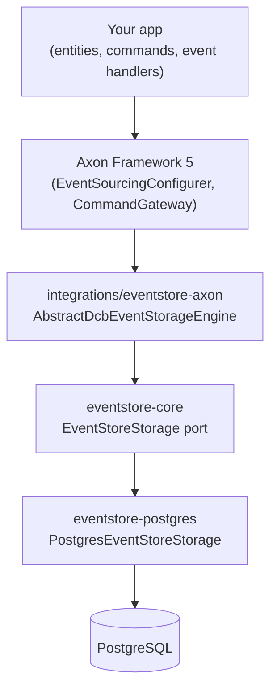

# How the Pieces Fit Together

OpenDCB is layered on purpose — each layer only knows about the one directly
below it. Here's what a command dispatch actually passes through, on the
`eventstore-postgres` deployment shape this site's quickstarts use:

## The four layers, and why each one exists

**Your app talks to Axon Framework 5**, not to OpenDCB directly. You define
entities (`@EventSourcedEntity`), commands, and events using Axon's own
annotations and dispatch commands through Axon's `CommandGateway` — see
[Build Your First Event-Sourced
Entity](../tutorials/build-your-first-event-sourced-entity.md) for exactly
what that looks like.

**Axon Framework 5 talks to `integrations/eventstore-axon`**, specifically
`AbstractDcbEventStorageEngine`, which implements Axon's own
`EventStorageEngine` SPI. This is the *adapter*: it translates Axon's types
(`TaggedEventMessage`, `AppendCondition`, `EventCriteria`) into plain,
framework-agnostic calls. It exists so Axon never has to know it's talking
to Postgres specifically — from Axon's point of view, it's just talking to
an `EventStorageEngine`.

**`integrations/eventstore-axon` talks to `eventstore-core`'s
`EventStoreStorage` port** — five methods (`appendAtomically`, `readRange`,
`maxPosition`, `minPosition`, `positionAtOrAfter`), all in plain Java, no
Axon type anywhere in the signature (see [What is
DCB](what-is-dcb.md) for what `appendAtomically`'s conflict check actually
does). This port is what makes the storage layer swappable: a second storage
provider can implement the same five methods without
`integrations/eventstore-axon` changing at all.

**`EventStoreStorage` is implemented by `eventstore-postgres`**
(`PostgresEventStoreStorage`), which is the only place that actually knows
it's talking to PostgreSQL — JDBC, a `pg_advisory_xact_lock` for cross-JVM
append safety, real SQL. If you swapped in `eventstore-mysql` or
`eventstore-mongo` instead, nothing above this layer would need to change.

## Add these when you need them

The four layers above are the whole story for a single-instance deployment.
A few optional modules sit alongside this stack for specific needs — add
them only when you actually hit the problem they solve:

- **Running more than one instance of your app?**
  [`opendcb-axon-spring-boot-routing`](../module-guides/spring-boot-starter-and-scaling.md)
  coordinates event-processor segments across instances via a shared
  `JdbcTokenStore`.
- **Need to publish events to another service?**
  [`outbox-relay-*`](../module-guides/event-routing-and-microservices.md)
  tails `EventStoreStorage.readRange` directly and publishes a
  deliberately-shaped integration event over a transport like RabbitMQ.
- **Need to fire an event at a future time?**
  [`opendcb-scheduling-core`](../module-guides/scheduling-events.md) polls
  its own table and appends via the same `EventStoreStorage` port shown
  above — no new dependency on Axon at all.
- **Coordinating a multi-step business process?**
  [`opendcb-conductor-bridge`](../module-guides/sagas-with-conductor.md)
  wires saga/process-manager support on top of Conductor OSS.
